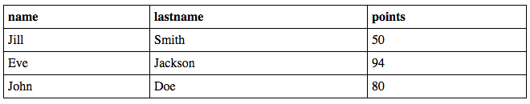

## Some comments for this example:

Assume that students look like this:

	students: [
		{ 'sid': '10', 'name': 'Jill', 'lastname': 'Smith', 'points': 50},
	    { 'sid': '20', 'name': 'Eve', 'lastname': 'Jackson', 'points': 94},
	    { 'sid': '30', 'name': 'John', 'lastname': 'Doe', 'points': 80}

	]
	
	
1. Notice in this example the application developer knows the attribute names in advance and he specifically uses them (he doesn't have to iterate over the attributes of the students object)

view:

 

		<% template root() %>
			<% refresh students = getStudents() %>
			<% html %>
				<table>	
					<tr>
						<th> name </th>
						<th> lastname </th>
						<th> points </th>
					</tr>
					<% for student in students %>
						<tr>
							<td> <%= student.name %></td>
							<td> <%= student.lastname %></td>
							<td> <%= student.points %></td>
							
						</tr>
					<% end for %>
			
				</table>			
				
			<% end html %>
		<% end template %>

2. Note: I don't like the fact that we cannot support "break" within a for loop. In the following example I'm assuming that the developer doesn't know the attributes of the students (or they might change dynamically) but he still wants to print the users in an html table and use the attributes as the table header.

		<% template root() %>
			<% refresh students = getStudents() %>
			<% refresh attributes = getStudentAttributes(students) %>
			<% html %>
				<table>	
					<tr>
						<% for attribute in attributes %>
							<th><%= attribute %></th>
						<% end for %>
					</tr>
					<% for student in students %>
						<tr>
							<% for attribute in attributes %>
								<td> <%= student[attribute] %></td>
							<% end for %>
						</tr>
					<% end for %>
			
				</table>			
				
			<% end html %>
		<% end template %>
