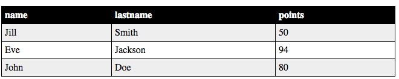

## Some comments for this example:

Assume that students look like this:

	students: [
		{ 'sid': '10', 'name': 'Jill', 'lastname': 'Smith', 'points': 50},
	    { 'sid': '20', 'name': 'Eve', 'lastname': 'Jackson', 'points': 94},
	    { 'sid': '30', 'name': 'John', 'lastname': 'Doe', 'points': 80}

	]
	
	
1. Notice in this example the application developer knows the attribute names in advance and he specifically uses them (he doesn't have to iterate over the attributes of the students object)

view:

 

		<% template root() %>
			<% refresh students = getStudents() %>
			<% html %>
				<table>	
					<tr class="header_css">
						<th> name </th>
						<th> lastname </th>
						<th> points </th>
					</tr>
					<% for i,student in students %>
						<% if i % 2 === 0 then %>
							<tr class="even_class">
								<td> <%= student.name %></td>
								<td> <%= student.lastname %></td>
								<td> <%= student.points %></td>
							</tr>
						<% else %>
							<tr class="odd_class">
								<td> <%= student.name %></td>
								<td> <%= student.lastname %></td>
								<td> <%= student.points %></td>
							</tr>
						<% end if %>
						
					<% end for %>
			
				</table>			
				
			<% end html %>
		<% end template %>

